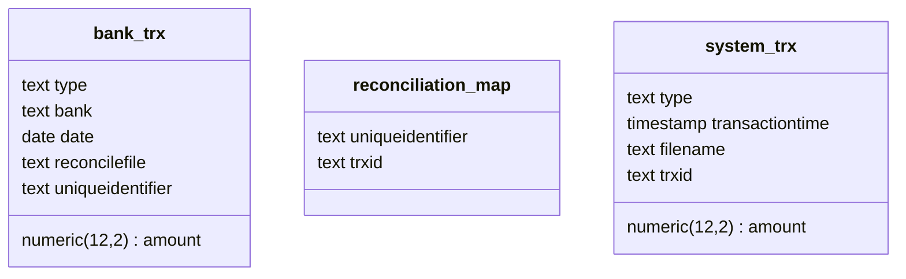

# POC Reconciliation Service With Postgresql
## Summary
This repository try to accommodate Reconciliation Transaction data matching with Bank Statements with only using SQLs, bash scripts, make and psql tools. 

## Challenges
Design and implement a transaction reconciliation service that identifies unmatched and discrepant transactions between internal data (system transactions) and external data (bank statements).

### Problem Statement:
Need to manages multiple bank accounts and requires a service to reconcile transactions occurring within their system against corresponding transactions reflected in bank statements. This process helps identify errors, discrepancies, and missing transactions.

### Data Model:
- Transaction:
  - `trxID` : Unique identifier for the transaction (string)
  - `amount` : Transaction amount (decimal)
  - `type` : Transaction type (enum: DEBIT, CREDIT)
  - `transactionTime` : Date and time of the transaction (datetime)

- Bank Statement:
  - `unique_identifier` : Unique identifier for the transaction in the bank statement (string) (varies by bank, not necessarily equivalent to trxID )
  - `amount` : Transaction amount (decimal) (can be negative for debits)
  - `date` : Date of the transaction (date)

### Assumptions:
- Both system transactions and bank statements are provided as separate CSV files.
- Discrepancies only occur in amount.

### Functionality:
- The service accepts the following input parameters:
  - System transaction CSV file path 
  - Bank statement CSV file path (can handle multiple files from different banks)
  - Start date for reconciliation timeframe (date)
  - End date for reconciliation timeframe (date)
- The service performs the reconciliation process by comparing transactions within the specified timeframe across system and bank statement data.
- The service outputs a reconciliation summary containing:
  - Total number of transactions processed 
  - Total number of matched transactions 
  - Total number of unmatched transactions 
  - Details of unmatched transactions:
    - System transaction details if missing in bank statement(s)
    - Bank statement details if missing in system transactions (grouped by bank)
    - Total discrepancies (sum of absolute differences in amount between matched transactions)

## How it's work
### Prerequisites
#### Tools
- Docker : https://docs.docker.com/engine/install/
- Psql : https://www.timescale.com/blog/how-to-install-psql-on-mac-ubuntu-debian-windows/
- Make tools
- Linux base environment to run shell scripts

### Directories and Files Structure
- `.docker` : directory as docker volume of posgresql docker container
- `sample` : directory of generated samples
  - `bank_trx` : directory of bank statements samples generated by script, will contains csv files with file name format `<bank name>_<unix time>.csv`
  - `system_trx` : directory of system transactions samples generated by script, will contains csv files with file name format `<unix time>.csv`
- `scripts` : contains sql and shell script files required to run the service
- `docker-compose.yml` : docker compose configuration file to run `postgres` DB server in docker
- `Makefile` : make file to run service commands
- `Readme.md` : this file

### Clone The Code
- Open your terminal
- Go to `/tmp` via command
```
cd /tmp
```
- Clone the code via command
```
git clone https://github.com/oprekable/sampe-cli-reconciliation-service.git
```
- Go to code directory via command
```
cd sampe-cli-reconciliation-service
```

### Generate Samples Data
- Open your terminal
- Go to project root directory and run command
```
make generate-sample
```
- Expect old files in `sample/bank_trx` and `sample/system_trx` removed and new CSV files generated
- Sample CSV files will generate data from 7 days back to current date 

### Do Reconciliation
- Open your terminal
- Go to project root directory and run command
```
make import-reconcile from=2024-11-01 to=2024-11-02
```
- The command will do reconciliation process from CSV files only for data at range `2024-11-01` to `2024-11-02`. Change value of date range with max range 7 days back
- Will expect information in terminal such :
```
----------------------------------------------------------------
RECONCILIATION SUMMARY
----------------------------------------------------------------

-[ RECORD 1 ]--------------------------+-------------
Total number of transactions processed | 1507
Total number of matched transactions   | 497
Total number of unmatched transactions | 1010
Sum amount all transactions            | 753390000.00
Sum amount matched transactions        | 245669000.00
Total discrepancies                    | 507721000.00

-------------------------------------------------------------------------------------------------------------
Missing System Transaction Details              : /tmp/sampe-cli-reconciliation-service/reports/missing_system_trx.csv
Missing Bank Statement Details - BCA            : /tmp/sampe-cli-reconciliation-service/reports/missing_bank_trx_bca.csv
Missing Bank Statement Details - BRI            : /tmp/sampe-cli-reconciliation-service/reports/missing_bank_trx_bri.csv
Missing Bank Statement Details - MANDIRI        : /tmp/sampe-cli-reconciliation-service/reports/missing_bank_trx_mandiri.csv
Missing Bank Statement Details - DANAMON        : /tmp/sampe-cli-reconciliation-service/reports/missing_bank_trx_danamon.csv
-------------------------------------------------------------------------------------------------------------
```
- Open report CSV files to get missing/unmatched details 

### Data on The Tables
- Script will generate postgres tables such 

- Access postgres DB server with credential
```
host : localhost
post : 15432
username : oprekable
password : oprekable
DB : oprekable
```

### Demo
[](https://asciinema.org/a/n4VWT0cb5V61OVBsbsCt4CY5H)